# rcss_cluster 设计文档

## 1. 项目概述

`rcss_cluster` 是一个基于 Rust 构建的 **RoboCup Soccer Simulator (rcssserver) 集群管理系统**，旨在通过 Kubernetes + [Agones](https://agones.dev/) 实现 RoboCup 2D 仿真比赛的分布式编排与管理。

### 1.1 核心目标

| 目标 | 说明 |
|------|------|
| **分布式比赛调度** | 在 Kubernetes 集群中并行运行多场 RoboCup 仿真比赛 |
| **统一接入层** | 提供 HTTP/WebSocket API，屏蔽底层 UDP 协议细节 |
| **弹性伸缩** | 利用 Agones Fleet 机制实现 GameServer 的按需调度 |
| **生命周期管理** | 自动化管理 rcssserver 进程、教练客户端、球员代理的完整生命周期 |
| **可插拔策略** | 支持 Bot（本地程序）和 Agent（gRPC 远程代理）两种球员策略 |

### 1.2 技术栈

- **语言**: Rust (Edition 2024)
- **异步运行时**: Tokio
- **Web 框架**: Axum
- **游戏服务器编排**: Agones (Kubernetes CRD)
- **进程间通信**: UDP（rcssserver 原生协议）、WebSocket（客户端代理）、gRPC（Agones SDK）
- **并发原语**: `DashMap`、`tokio::sync::{mpsc, watch, oneshot}`

---

## 2. 宏观架构

### 2.1 系统架构全景

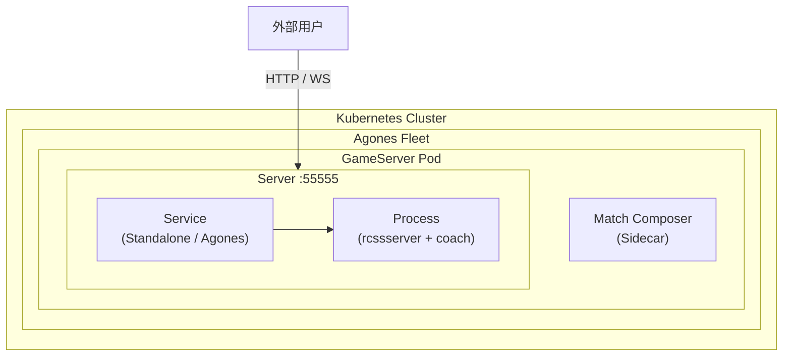
```mermaid
graph TB
    User["外部用户"]

    subgraph K8s["Kubernetes Cluster"]
        subgraph Fleet["Agones Fleet"]
            subgraph Pod["GameServer Pod"]
                subgraph ServerBox["Server :55555"]
                    Service["Service<br/>(Standalone / Agones)"]
                    Process["Process<br/>(rcssserver + coach)"]
                    Service --> Process
                end
                Composer["Match Composer<br/>(Sidecar)"]
            end
        end
    end

    User -->|"HTTP / WS"| ServerBox
```

### 2.2 部署模式

系统支持两种部署模式，通过编译时 feature flag 切换：

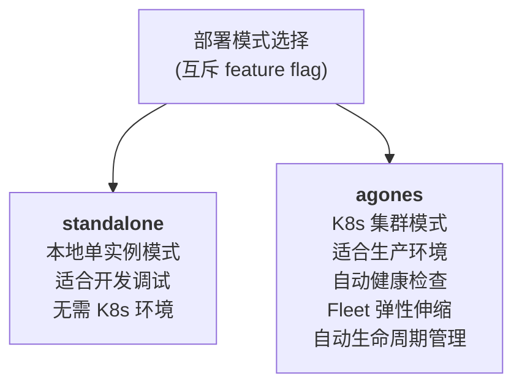
```mermaid
flowchart TB
    Deploy["部署模式选择<br/>(互斥 feature flag)"]
    Deploy --> Standalone["<b>standalone</b><br/>本地单实例模式<br/>适合开发调试<br/>无需 K8s 环境"]
    Deploy --> Agones["<b>agones</b><br/>K8s 集群模式<br/>适合生产环境<br/>自动健康检查<br/>Fleet 弹性伸缩<br/>自动生命周期管理"]
```

---

## 3. Workspace 模块总览

```
rcss_cluster/                      Cargo Workspace Root
├── common/                        共享基础库
│   └── src/
│       ├── client/                UDP 客户端抽象
│       ├── command/               命令编解码系统
│       ├── process/               子进程管理原语
│       ├── types/                 RoboCup 仿真类型
│       ├── udp/                   UDP 连接抽象
│       └── utils/                 工具 (环形缓冲区等)
│
├── process/                       rcssserver 进程管理
│   └── src/
│       ├── client/                高级客户端 (含 Addon 扩展系统)
│       ├── player/                球员客户端
│       ├── trainer/               教练客户端 (OfflineCoach)
│       └── process/               服务器进程 + 配置系统
│
├── service/                       服务层抽象
│   └── src/
│       ├── base/                  核心服务 (BaseService)
│       ├── addons/                服务插件 (时间/比赛模式追踪)
│       ├── standalone/            本地单实例模式
│       └── agones/                Agones 集成模式
│
├── server/                        HTTP/WS 后端服务
│   └── src/
│       ├── http/                  HTTP 路由 (command/control/gateway)
│       ├── proxy/                 UDP/WS 代理
│       ├── error/                 错误处理
│       ├── state.rs               应用状态管理
│       └── main.rs                入口点
│
└── sidecars/
    └── match_composer/            比赛编排 Sidecar
        └── src/
            ├── schema/            配置 Schema (v1)
            ├── config/            运行时配置
            ├── image/             镜像管理 (Bot/Agent)
            ├── policy/            策略注册表
            ├── server/            HTTP API
            ├── composer.rs        比赛编排器
            └── team.rs            队伍管理
```

### 3.1 依赖关系图

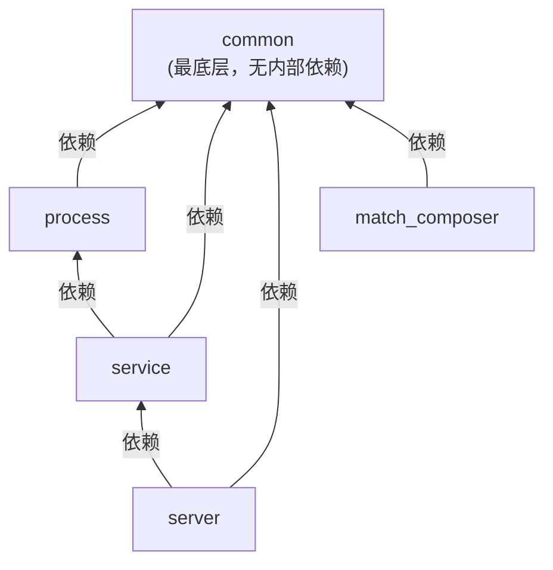
```mermaid
graph BT
    common["common<br/>(最底层，无内部依赖)"]
    process["process"] -->|依赖| common
    service["service"] -->|依赖| common
    service -->|依赖| process
    server["server"] -->|依赖| common
    server -->|依赖| service
    match_composer["match_composer"] -->|依赖| common
```

---

## 4. 模块详细设计

### 4.1 common — 共享基础库

`common` 是所有模块的基础依赖，提供与 rcssserver 通信所需的核心原语。

#### 4.1.1 Client 子模块 — UDP 客户端抽象

```
common::client::Client
├── config: Config                         客户端配置（名称、地址）
├── handle: OnceLock<JoinHandle>           异步任务句柄（一次性写入）
├── signal_tx: OnceLock<Sender<Signal>>    控制信号通道
├── data_tx: OnceLock<Sender<ArcStr>>      数据发送通道
├── status: Arc<AtomicStatus>              原子化状态追踪
└── consumers: Arc<DashMap<Uuid, Sender>>  订阅者注册表
```

**设计要点**:

- **信号/数据通道分离**: `signal_tx` 用于控制命令（如 `Shutdown`），`data_tx` 用于业务数据，避免控制流和数据流互相阻塞。
- **发布-订阅模式**: 通过 `subscribe()/unsubscribe()` 管理多个消费者。每个消费者持有独立的 `mpsc::Sender`，由 `Uuid` 唯一标识。
- **连接生命周期**: 使用 `OnceLock` 确保 `connect()` 仅执行一次，避免重复连接。
- **初始化握手**: `run()` 启动时先等待上层通过 `data_tx` 发送 init 消息（rcssserver 协议要求），然后执行 UDP 握手获取服务器端口重定向。

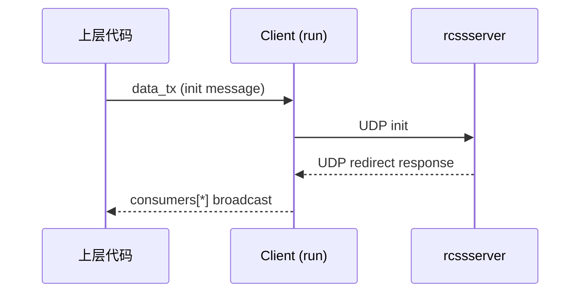
```mermaid
sequenceDiagram
    participant Caller as 上层代码
    participant Client as Client (run)
    participant RCSS as rcssserver

    Caller->>Client: data_tx (init message)
    Client->>RCSS: UDP init
    RCSS-->>Client: UDP redirect response
    Client-->>Caller: consumers[*] broadcast
```

#### 4.1.2 Command 子模块 — 命令编解码系统

命令系统采用 **trait-based 泛型设计**，同时支持编译时类型安全和运行时动态分派：

```rust
// 核心 trait 设计
trait Command {
    type Kind: CommandAny;     // 命令类别枚举
    type Ok;                   // 成功返回类型
    type Error;                // 错误返回类型
    fn kind(&self) -> Self::Kind;
    fn encode(&self) -> ArcStr;     // 编码为 rcssserver 协议字符串
}

trait CommandAny {
    fn encode(&self) -> &str;       // 命令名编码
    fn decode(s: &str) -> Option<Self>;  // 从字符串解码
    fn parse_ret_ok(&self, tokens: &[&str]) -> Option<Box<dyn Any + Send>>;
    fn parse_ret_err(&self, tokens: &[&str]) -> Option<Box<dyn Any + Send>>;
}
```

**命令枚举**:

```
TrainerCommand (10 种)           PlayerCommand (1 种)
├── ChangeMode                   └── Init
├── Move
├── CheckBall
├── Start
├── Recover
├── Ear / Eye
├── Init
├── Look
└── TeamNames
```

#### 4.1.3 Process 子模块 — 子进程管理原语

```
common::process::Process
├── child: Child (tokio)          受管子进程
├── stdout_tx / stderr_tx         广播通道 (stdout/stderr)
├── status: watch::Sender         进程状态广播
└── shutdown → SIGINT → SIGKILL   优雅关闭链
```

**进程状态机**:

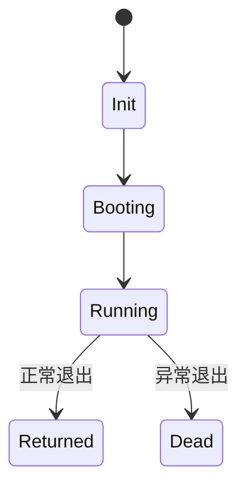
```mermaid
stateDiagram-v2
    [*] --> Init
    Init --> Booting
    Booting --> Running
    Running --> Returned : 正常退出
    Running --> Dead : 异常退出
```

#### 4.1.4 Types 子模块 — RoboCup 仿真类型

定义了完整的 RoboCup 2D 仿真类型，支持 `encode()/decode()` 和 Serde 序列化：

| 类型 | 说明 | 变体数 |
|------|------|--------|
| `PlayMode` | 比赛模式 | 63 种（BeforeKickOff, PlayOn, KickOff_Left, ...） |
| `Side` | 阵营 | LEFT(1), NEUTRAL(0), RIGHT(-1) |
| `BallPosition` | 球位状态 | InField, GoalL, GoalR, OutOfField |
| `EarMode` / `EyeMode` | 教练模式开关 | On / Off |

---

### 4.2 process — rcssserver 进程管理

`process` crate 负责 rcssserver 及其配套客户端（教练/球员）的完整生命周期管理。

#### 4.2.1 核心架构

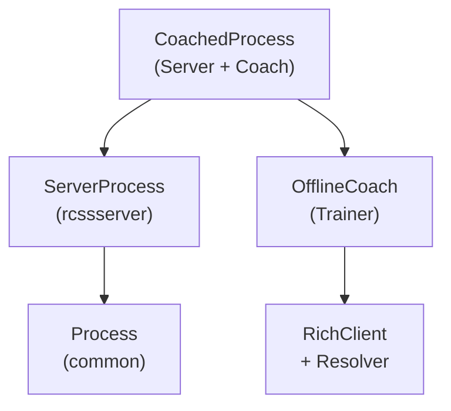
```mermaid
graph TB
    CP["CoachedProcess<br/>(Server + Coach)"]
    CP --> SP["ServerProcess<br/>(rcssserver)"]
    CP --> OC["OfflineCoach<br/>(Trainer)"]
    SP --> Proc["Process<br/>(common)"]
    OC --> RC["RichClient<br/>+ Resolver"]
```

#### 4.2.2 ServerProcess — 服务器进程封装

```rust
ServerProcess {
    process: common::process::Process,   // 底层进程
    ready_rx: watch::Receiver<bool>,     // 就绪信号
}
```

**就绪检测机制**: 监听 rcssserver 的 stdout 输出，当检测到 `"Hit CTRL-C to exit"` 时标记为就绪。这是 rcssserver 启动完成的标志信号。

**配置系统**: 使用 `create_config!` 宏生成 200+ 个 rcssserver 配置参数的类型安全封装：

```
Config
├── ServerConfig    (server::* 参数，如端口、仿真步长等)
├── PlayerConfig    (player::* 参数)
└── CsvSaverConfig  (csv_saver::* 参数)
```

#### 4.2.3 RichClient + Addon 扩展系统

`RichClient` 在 `common::Client` 基础上叠加了可插拔的 Addon 扩展机制：

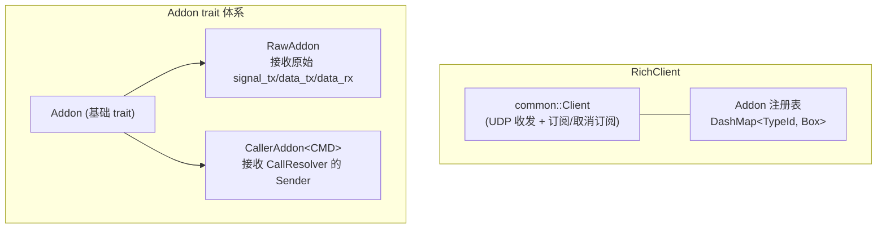
```mermaid
graph TB
    subgraph RichClient["RichClient"]
        Client["common::Client<br/>(UDP 收发 + 订阅/取消订阅)"]
        Addons["Addon 注册表<br/>DashMap&lt;TypeId, Box&gt;"]
        Client --- Addons
    end

    subgraph AddonTraits["Addon trait 体系"]
        Base["Addon (基础 trait)"]
        Base --> RawAddon["RawAddon<br/>接收原始 signal_tx/data_tx/data_rx"]
        Base --> CallerAddon["CallerAddon&lt;CMD&gt;<br/>接收 CallResolver 的 Sender"]
    end
```

#### 4.2.4 CallResolver — 命令-响应解析器

这是整个命令系统最精巧的设计，解决了 **UDP 协议的异步请求-响应匹配** 问题：

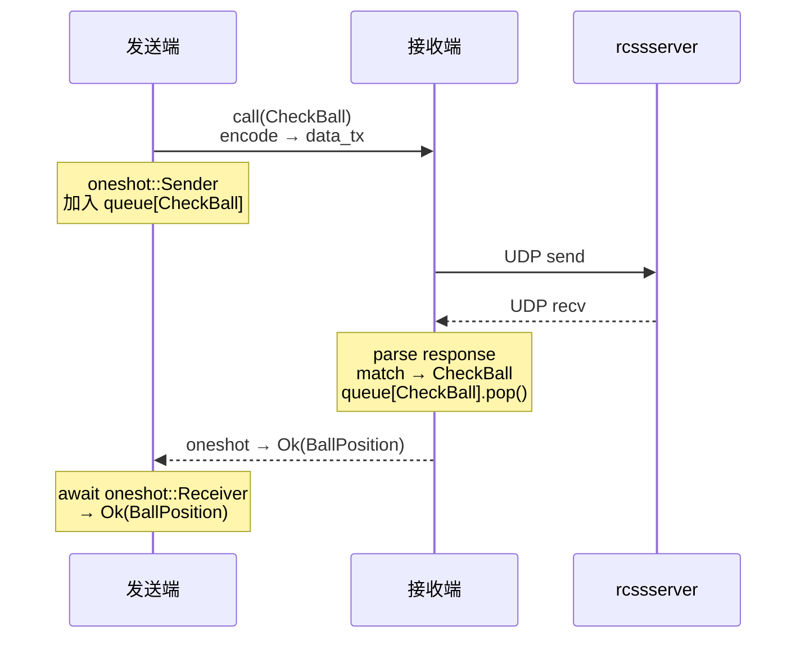
```mermaid
sequenceDiagram
    participant Sender as 发送端
    participant Receiver as 接收端
    participant RCSS as rcssserver

    Sender->>Receiver: call(CheckBall)<br/>encode → data_tx
    Note over Sender: oneshot::Sender<br/>加入 queue[CheckBall]
    Receiver->>RCSS: UDP send
    RCSS-->>Receiver: UDP recv
    Note over Receiver: parse response<br/>match → CheckBall<br/>queue[CheckBall].pop()
    Receiver-->>Sender: oneshot → Ok(BallPosition)
    Note over Sender: await oneshot::Receiver<br/>→ Ok(BallPosition)
```

**关键设计决策**:

- **按命令类型排队**: `DashMap<CMD, VecDeque<oneshot::Sender>>` 将响应按命令类型分发到对应的等待队列。
- **类型擦除 + 向下转型**: 使用 `Box<dyn Any + Send>` 实现异构返回值的类型安全传递。
- **超时保护**: 每次 `call()` 带有 2 秒超时，防止无响应场景的死锁。
- **弱引用支持**: `WeakSender` 避免循环引用，当调用方被释放时自动失效。

#### 4.2.5 CoachedProcess — 服务器+教练协同

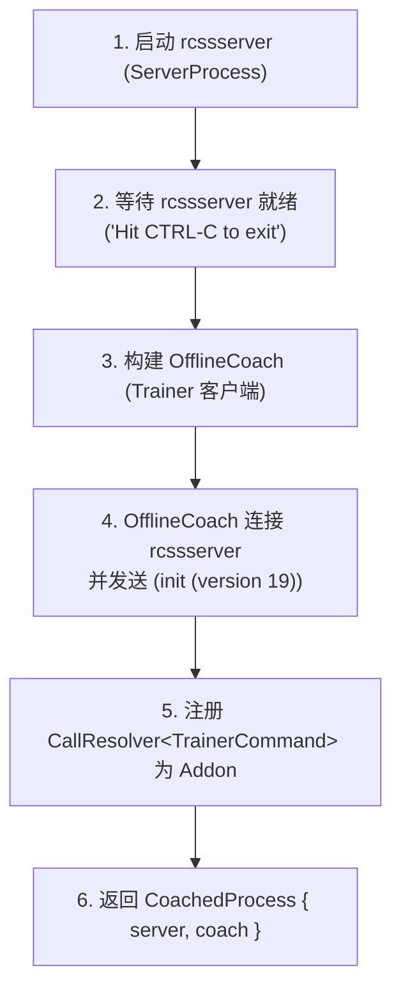
```mermaid
flowchart TB
    S1["1. 启动 rcssserver (ServerProcess)"]
    S2["2. 等待 rcssserver 就绪<br/>('Hit CTRL-C to exit')"]
    S3["3. 构建 OfflineCoach (Trainer 客户端)"]
    S4["4. OfflineCoach 连接 rcssserver<br/>并发送 (init (version 19))"]
    S5["5. 注册 CallResolver&lt;TrainerCommand&gt; 为 Addon"]
    S6["6. 返回 CoachedProcess { server, coach }"]

    S1 --> S2 --> S3 --> S4 --> S5 --> S6
```

---

### 4.3 service — 服务层抽象

`service` crate 在 `process` 之上封装了业务逻辑和部署模式抽象。

#### 4.3.1 BaseService — 核心服务

```
BaseService
├── config: BaseConfig
├── process: Option<AddonProcess>        当前运行的进程
├── status_tx: watch::Sender<Status>     状态广播
├── task_handles: Vec<JoinHandle>        后台任务集
└── trainer(): WeakSender<TrainerCommand> 教练命令发送器
```

**服务状态机**:

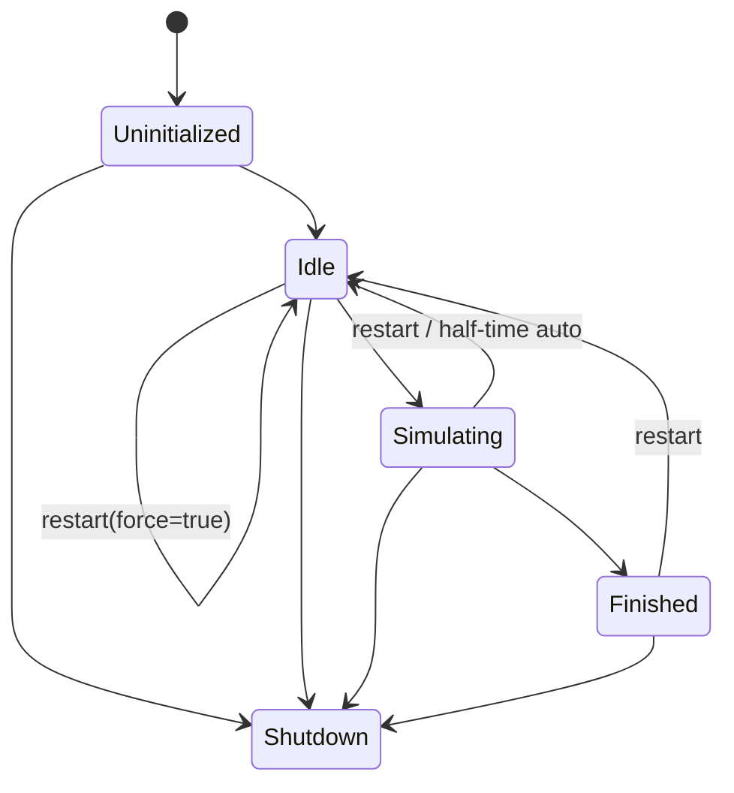
```mermaid
stateDiagram-v2
    [*] --> Uninitialized
    Uninitialized --> Idle
    Uninitialized --> Shutdown

    Idle --> Simulating
    Idle --> Idle : restart(force=true)
    Idle --> Shutdown

    Simulating --> Finished
    Simulating --> Idle : restart / half-time auto
    Simulating --> Shutdown

    Finished --> Idle : restart
    Finished --> Shutdown
```

**后台任务**:

| 任务 | 功能 | 触发条件 |
|------|------|----------|
| `status_task` | 轮询 `TimeStatusAddon` 推断比赛阶段 | 时间戳变化 |
| `half_time_task` | 上半场结束自动执行 `KickOff` | `timestep == synch_offset` |
| `log_task` | 转发 rcssserver stdout/stderr 日志 | 持续运行 |

#### 4.3.2 AddonProcess — 带插件的进程封装

```rust
AddonProcess {
    coached: CoachedProcess,
    time_rx: watch::Receiver<Option<u16>>,  // 时间戳追踪
}
```

`AddonProcess` 在 `CoachedProcess` 基础上注册 `TimeStatusAddon`，定期通过 `CheckBall` 命令轮询当前仿真时间步。

#### 4.3.3 Standalone 模式

```rust
StandaloneService(BaseService)  // 简单包装，无额外逻辑
```

直接暴露 `BaseService` 的所有功能，适合本地开发和单机测试。

#### 4.3.4 Agones 模式

```
AgonesService
├── base: BaseService
├── sdk: Arc<Sdk>           Agones SDK 客户端
├── health_task             定期向 Agones 报告健康状态
└── auto_shutdown_task      比赛结束时自动调用 sdk.shutdown()
```

**Agones 集成点**:

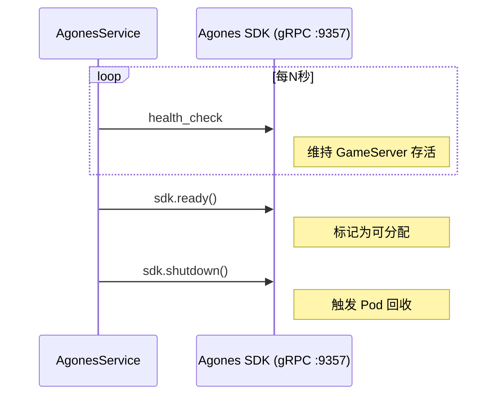
```mermaid
sequenceDiagram
    participant AS as AgonesService
    participant SDK as Agones SDK (gRPC :9357)

    loop 每N秒
        AS->>SDK: health_check
        Note right of SDK: 维持 GameServer 存活
    end
    AS->>SDK: sdk.ready()
    Note right of SDK: 标记为可分配
    AS->>SDK: sdk.shutdown()
    Note right of SDK: 触发 Pod 回收
```

---

### 4.4 server — HTTP/WS 后端服务

`server` crate 是后端核心，提供 HTTP API 和 WebSocket 代理。

#### 4.4.1 路由设计

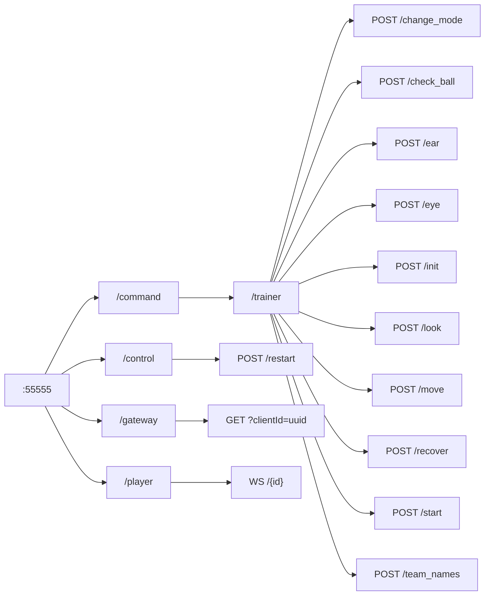
```mermaid
graph LR
    Root[":55555"]

    Root --> Command["/command"]
    Command --> Trainer["/trainer"]
    Trainer --> CM["POST /change_mode"]
    Trainer --> CB["POST /check_ball"]
    Trainer --> Ear["POST /ear"]
    Trainer --> Eye["POST /eye"]
    Trainer --> Init["POST /init"]
    Trainer --> Look["POST /look"]
    Trainer --> Move["POST /move"]
    Trainer --> Recover["POST /recover"]
    Trainer --> Start["POST /start"]
    Trainer --> TN["POST /team_names"]

    Root --> Control["/control"]
    Control --> Restart["POST /restart"]

    Root --> Gateway["/gateway"]
    Gateway --> GGet["GET ?clientId=uuid"]

    Root --> Player["/player"]
    Player --> WS["WS /{id}"]
```

#### 4.4.2 应用状态管理

```rust
AppState {
    service: Arc<Service>,              // StandaloneService 或 AgonesService
    session_manager: Arc<SessionManager>,  // UDP 会话管理
    status: watch::Sender<AppStateStatus>, // Running / ShuttingDown / Stopped
}
```

**优雅关闭流程**:

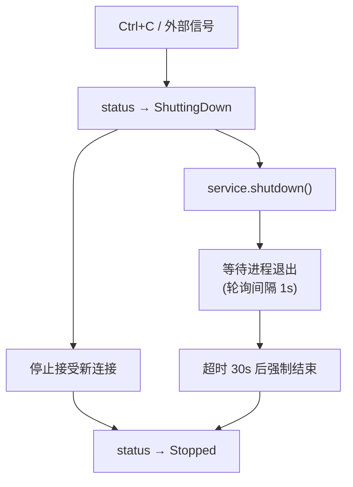
```mermaid
flowchart TB
    Signal["Ctrl+C / 外部信号"]
    Signal --> Status["status → ShuttingDown"]
    Status --> Stop["停止接受新连接"]
    Status --> Shutdown["service.shutdown()"]
    Shutdown --> Wait["等待进程退出<br/>(轮询间隔 1s)"]
    Wait --> Timeout["超时 30s 后强制结束"]
    Stop --> Stopped["status → Stopped"]
    Timeout --> Stopped
```

#### 4.4.3 代理系统

**UDP 代理 (SessionManager)**:

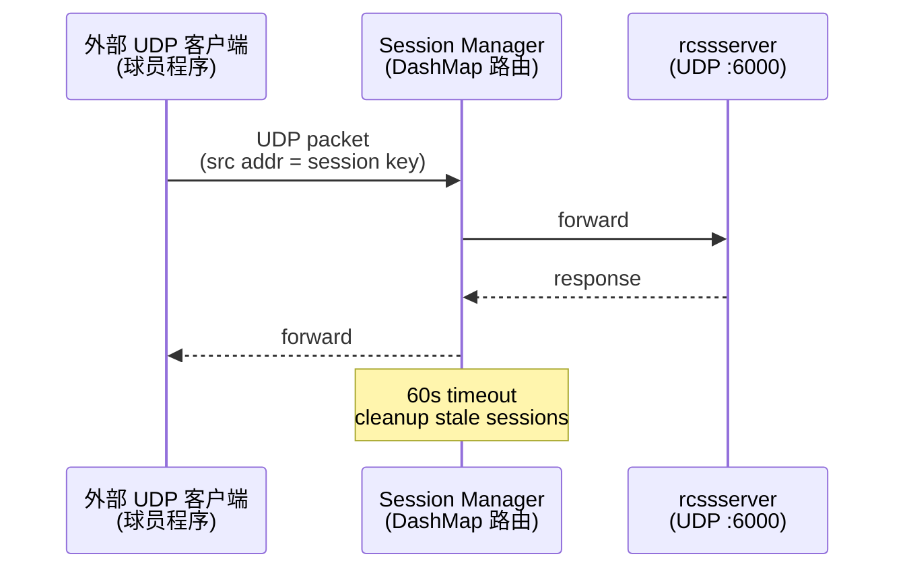
```mermaid
sequenceDiagram
    participant UDP as 外部 UDP 客户端<br/>(球员程序)
    participant SM as Session Manager<br/>(DashMap 路由)
    participant RCSS as rcssserver<br/>(UDP :6000)

    UDP->>SM: UDP packet<br/>(src addr = session key)
    SM->>RCSS: forward
    RCSS-->>SM: response
    SM-->>UDP: forward

    Note over SM: 60s timeout<br/>cleanup stale sessions
```

**WebSocket 代理**:

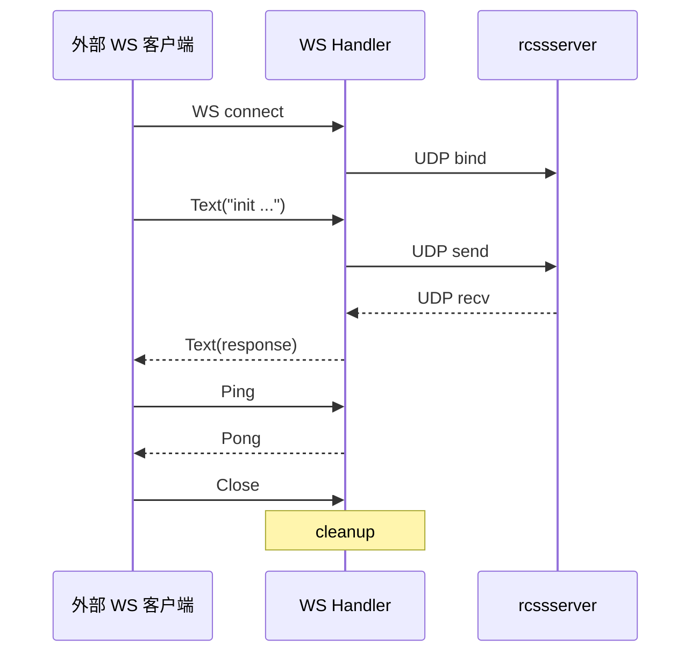
```mermaid
sequenceDiagram
    participant WS as 外部 WS 客户端
    participant Handler as WS Handler
    participant RCSS as rcssserver

    WS->>Handler: WS connect
    Handler->>RCSS: UDP bind
    WS->>Handler: Text("init ...")
    Handler->>RCSS: UDP send
    RCSS-->>Handler: UDP recv
    Handler-->>WS: Text(response)

    WS->>Handler: Ping
    Handler-->>WS: Pong

    WS->>Handler: Close
    Note over Handler: cleanup
```

---

### 4.5 sidecars/match_composer — 比赛编排 Sidecar

`match_composer` 是部署在 GameServer Pod 内的 sidecar 容器，负责编排完整比赛。

#### 4.5.1 整体职责

```mermaid
graph TB
    subgraph Pod["GameServer Pod"]
        subgraph Main["rcssserver (主容器)"]
            P6000[":6000 球员"]
            P6001[":6001 教练"]
            P6002[":6002 OlCoach"]
        end
        subgraph MC["Match Composer (Sidecar 容器)"]
            Bot["Bot 进程 (Helios)"]
            Agent["Agent (SSP+gRPC)"]
            API["HTTP API :8080"]
        end
        SDK["Agones SDK (:9357)"]
        MC -->|UDP| Main
        SDK -.->|"health/ready/shutdown"| Pod
    end
```

#### 4.5.2 配置 Schema 系统 (v1)

采用 **Schema → Runtime Config** 两层配置架构：

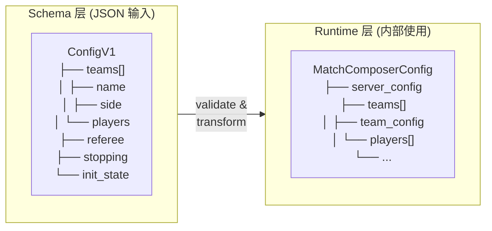
```mermaid
flowchart LR
    subgraph Schema["Schema 层 (JSON 输入)"]
        ConfigV1["ConfigV1<br/>├── teams[]<br/>│ ├── name<br/>│ ├── side<br/>│ └── players<br/>├── referee<br/>├── stopping<br/>└── init_state"]
    end

    Schema -->|"validate &<br/>transform"| Runtime

    subgraph Runtime["Runtime 层 (内部使用)"]
        MCC["MatchComposerConfig<br/>├── server_config<br/>├── teams[]<br/>│ ├── team_config<br/>│ └── players[]<br/>└── ..."]
    end
```

**输入配置 (ConfigV1) 校验规则**:

| 字段 | 规则 |
|------|------|
| `team.name` | ASCII, 长度 < 16 |
| `team.players` | 数量 ≤ 11 |
| `player.unum` | 1-12 |
| `player.position` | x ∈ [0,1], y ∈ [0,1] (归一化球场坐标) |
| `policy.image` | 格式为 `provider/model` |

#### 4.5.3 镜像与策略系统

```
Hub 目录结构:
  hub_path/
  ├── HELIOS/                  Provider (提供方)
  │   └── helios-base/         Model (模型)
  │       └── start_player.sh  Bot 启动脚本
  │
  └── Cyrus2D/                 Provider
      └── SoccerSimulationProxy/  Model
          └── ssp_binary       Agent 二进制
```

**策略注册表 (PolicyRegistry)**:

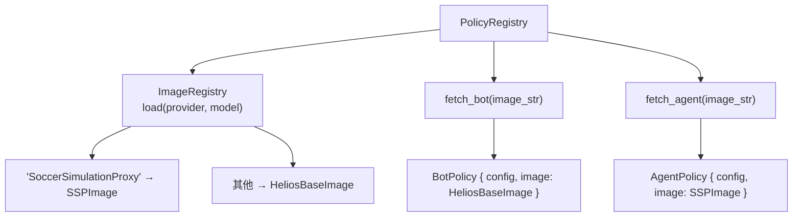
```mermaid
graph TB
    PR["PolicyRegistry"]
    PR --> IR["ImageRegistry<br/>load(provider, model)"]
    IR --> SSP["'SoccerSimulationProxy' → SSPImage"]
    IR --> Helios["其他 → HeliosBaseImage"]

    PR --> FetchBot["fetch_bot(image_str)"]
    FetchBot --> BotPolicy["BotPolicy { config, image: HeliosBaseImage }"]

    PR --> FetchAgent["fetch_agent(image_str)"]
    FetchAgent --> AgentPolicy["AgentPolicy { config, image: SSPImage }"]
```

**两种球员策略**:

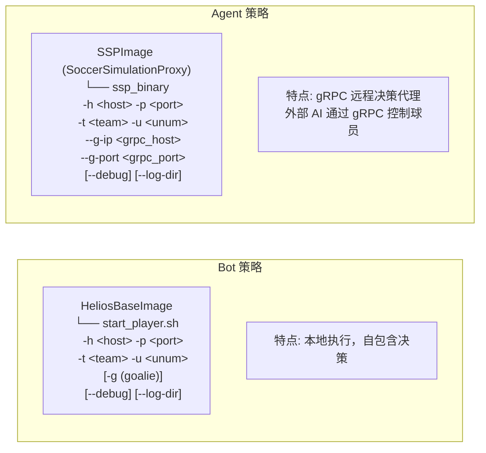
```mermaid
graph LR
    subgraph Bot["Bot 策略"]
        HBI["HeliosBaseImage<br/>└── start_player.sh<br/>&nbsp;&nbsp;&nbsp;&nbsp;-h &lt;host&gt; -p &lt;port&gt;<br/>&nbsp;&nbsp;&nbsp;&nbsp;-t &lt;team&gt; -u &lt;unum&gt;<br/>&nbsp;&nbsp;&nbsp;&nbsp;[-g (goalie)]<br/>&nbsp;&nbsp;&nbsp;&nbsp;[--debug] [--log-dir]"]
        BotNote["特点: 本地执行，自包含决策"]
    end

    subgraph Agent["Agent 策略"]
        SSPI["SSPImage (SoccerSimulationProxy)<br/>└── ssp_binary<br/>&nbsp;&nbsp;&nbsp;&nbsp;-h &lt;host&gt; -p &lt;port&gt;<br/>&nbsp;&nbsp;&nbsp;&nbsp;-t &lt;team&gt; -u &lt;unum&gt;<br/>&nbsp;&nbsp;&nbsp;&nbsp;--g-ip &lt;grpc_host&gt;<br/>&nbsp;&nbsp;&nbsp;&nbsp;--g-port &lt;grpc_port&gt;<br/>&nbsp;&nbsp;&nbsp;&nbsp;[--debug] [--log-dir]"]
        AgentNote["特点: gRPC 远程决策代理<br/>外部 AI 通过 gRPC 控制球员"]
    end
```

#### 4.5.4 MatchComposer — 比赛编排器

```
MatchComposer
├── allies: Team                     己方队伍
├── opponents: Team                  对方队伍
├── agent_conns: Vec<AgentConnInfo>  Agent gRPC 连接信息
│
├── spawn_players()                  启动所有球员进程
├── shutdown()                       关闭所有进程
└── wait()                           等待所有进程结束
```

**Team 状态机**:

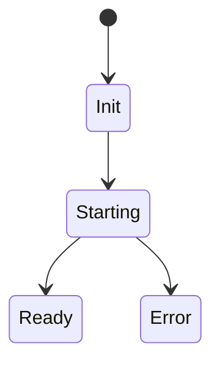
```mermaid
stateDiagram-v2
    [*] --> Init
    Init --> Starting
    Starting --> Ready
    Starting --> Error
```

Team 通过 `watch::channel` 广播状态变化，上层可订阅监听。

#### 4.5.5 HTTP API

```mermaid
graph LR
    Root[":8080"]
    Root --> Start["POST /start<br/>开始比赛"]
    Root --> Stop["POST /stop<br/>停止比赛"]
    Root --> Restart["POST /restart<br/>重启比赛"]
    Root --> Status["GET /status<br/>查询状态"]
```

---

## 5. 关键设计决策

### 5.1 通道架构 — 信号与数据分离

整个系统广泛采用 **信号/数据通道分离** 模式：

```mermaid
flowchart LR
    Caller["调用方"] -->|"signal_tx (控制)"| Worker["工作者"]
    Caller -->|"data_tx (数据)"| Worker
```

**优势**: 控制命令（如 Shutdown）不会被大量数据消息阻塞，确保系统在高负载下仍能及时响应控制信号。

### 5.2 OnceLock 的使用 — 单次初始化保障

`Client` 中使用 `OnceLock` 保护 `handle`、`signal_tx`、`data_tx`：

```rust
handle: OnceLock<JoinHandle<Result<()>>>,
signal_tx: OnceLock<mpsc::Sender<Signal>>,
data_tx: OnceLock<mpsc::Sender<ArcStr>>,
```

这确保了 `connect()` 的幂等性：多次调用不会创建多个连接，而是返回 `AlreadyConnected` 错误。

### 5.3 DashMap — 高并发映射

系统中广泛使用 `DashMap` 替代 `Mutex<HashMap>`：

| 使用场景 | Key | Value |
|---------|-----|-------|
| 客户端消费者注册表 | `Uuid` | `mpsc::Sender` |
| UDP 会话管理 | `SocketAddr` | `Session` |
| 命令响应队列 | `CMD` (命令枚举) | `VecDeque<oneshot::Sender>` |

**优势**: 分片锁（sharded lock）机制，避免全局锁竞争，适合高并发读写场景。

### 5.4 watch::channel — 状态广播

对于需要多方监听的状态变化，系统统一使用 `tokio::sync::watch`：

```mermaid
sequenceDiagram
    participant Producer as 状态生产者<br/>watch::Sender
    participant Consumer as 状态消费者 (多个)<br/>watch::Receiver (clone)

    Producer->>Consumer: send(new_status)
    Consumer->>Consumer: changed().await<br/>→ 获取最新状态
    Consumer->>Consumer: borrow()<br/>→ 直接读取当前值
```

使用场景：进程状态、服务状态、时间戳追踪、应用关闭信号。

### 5.5 优雅关闭 — 分层清理

```mermaid
flowchart TB
    Signal["外部信号 (Ctrl+C / Agones shutdown)"]

    subgraph ServerLayer["Server 层"]
        S1["1. 标记 status = ShuttingDown"]
        S2["2. 停止接受新连接"]
    end

    subgraph ServiceLayer["Service 层"]
        S3["3. service.shutdown()"]
        S4["4. 等待后台任务结束"]
    end

    subgraph ProcessLayer["Process 层"]
        S5["5. SIGINT → rcssserver"]
        S6["6. 等待超时 → SIGKILL"]
        S7["7. 回收子进程"]
    end

    subgraph ClientLayer["Client 层 (common::client)"]
        S8["8. signal_tx → Shutdown"]
        S9["9. 等待 UDP 任务结束"]
        S10["10. 清理消费者"]
    end

    Signal --> ServerLayer --> ServiceLayer --> ProcessLayer --> ClientLayer
```

---

## 6. 数据流全景

### 6.1 教练命令数据流 (HTTP → rcssserver)

```mermaid
sequenceDiagram
    participant HTTP as HTTP Client
    participant Server as Server (Axum)
    participant Service as Service
    participant Process as Process
    participant RCSS as rcssserver

    HTTP->>Server: POST /command/<br/>trainer/move<br/>{x: 10, y: 5}
    Server->>Service: trainer()
    Service->>Process: call(Move)
    Note over Process: encode()<br/>"(move 10 5)"
    Process->>RCSS: data_tx → UDP
    RCSS-->>Process: UDP recv
    Note over Process: CallResolver<br/>parse → oneshot
    Process-->>Service: Ok(())
    Service-->>Server: Ok(())
    Server-->>HTTP: Response(200)
```

### 6.2 球员 WebSocket 连接数据流 (外部 → Server → rcssserver)

```mermaid
sequenceDiagram
    participant Player as 球员程序<br/>(WS Client)
    participant Server as Server<br/>(WS Handler)
    participant RCSS as rcssserver<br/>(UDP)

    Player->>Server: WS connect /player/{id}
    Server->>RCSS: UDP bind
    Player->>Server: WS send("init ...")
    Server->>RCSS: UDP send
    RCSS-->>Server: UDP recv
    Server-->>Player: WS Text(response)

    loop 后续正常收发
        Player->>Server: WS Text(command)
        Server->>RCSS: UDP send
        RCSS-->>Server: UDP recv
        Server-->>Player: WS Text(response)
    end
```

---

## 7. Kubernetes 部署架构

### 7.1 Agones 资源模型

```mermaid
graph TB
    subgraph Fleet["Fleet (agones-rcss-server)"]
        Config["replicas: 5<br/>scheduling: Packed<br/>strategy: RollingUpdate"]
        Counters["counters:<br/>rooms: { count: 0, cap: 100 }"]
        Lists["lists:<br/>players: []"]

        subgraph Template["GameServer 模板"]
            Ports["ports:<br/>default :55555/TCP (HTTP API)<br/>player :6000/TCP<br/>trainer :6001/TCP<br/>coach :6002/TCP"]
            Health["health:<br/>initialDelay: 30s<br/>period: 30s<br/>failureThreshold: 3"]
            SDK["sdkServer:<br/>grpcPort: 9357<br/>httpPort: 9358"]
        end
    end
```

### 7.2 Docker 构建流程

```mermaid
flowchart TB
    subgraph Build["构建阶段"]
        Chef["Stage 1: chef<br/>安装 cargo-chef + protoc"]
        Planner["Stage 2: planner<br/>生成依赖 recipe.json"]
        Builder["Stage 3: builder<br/>编译 rcssserver + agones-server<br/>(cargo-chef 缓存依赖层)"]
        Chef --> Planner --> Builder
    end

    Build --> Run

    subgraph Run["运行阶段 (alpine:latest)"]
        Bin1["/usr/local/bin/agones-server"]
        Bin2["/usr/local/bin/rcssserver"]
        Lib["/usr/local/lib/*"]
        Expose["EXPOSE: 6000-6002/UDP, 55555/TCP<br/>ENTRYPOINT: agones-server"]
    end
```

### 7.3 Match Composer 容器构建

Match Composer 的 Dockerfile 采用更复杂的多阶段构建：

```mermaid
flowchart TB
    cpp["cpp-base<br/>C++ 编译工具链"]
    cpp --> librcsc["librcsc-builder<br/>librcsc 库 (RoboCup 基础库)"]
    cpp --> grpc["grpc-builder<br/>gRPC C++ v1.62.0"]
    librcsc --> helios["helios-builder<br/>helios-base (HELIOS 基础球员)"]
    grpc --> ssp["ssp-builder<br/>SoccerSimulationProxy (Cyrus2D)"]
    rust["rust-builder<br/>match_composer Rust 二进制"]

    subgraph Final["最终镜像"]
        F1["match_composer (编排器)"]
        F2["helios-base/ (HELIOS Bot)"]
        F3["SoccerSimulationProxy/ (SSP Agent)"]
        F4["依赖库 (librcsc, grpc)"]
    end

    helios --> Final
    ssp --> Final
    rust --> Final
```

---

## 8. 错误处理策略

系统采用分层错误处理，每层定义自己的 `Error` 枚举并向上转换：

```mermaid
flowchart TB
    E1["common::client::Error<br/>底层 UDP/通道错误"]
    E2["process::Error<br/>进程启动/关闭错误"]
    E3["service::Error<br/>服务级错误 (含业务语义)"]
    E4["server::error::Error<br/>HTTP 错误 (映射到状态码)"]
    E5["HTTP Response<br/>标准化 JSON 响应<br/>{ code: 4xx/5xx, data: '...' }"]

    E1 --> E2 --> E3 --> E4 --> E5
```

**HTTP 状态码映射**:

| 服务错误 | HTTP 状态码 |
|---------|------------|
| `NotReady` | 503 Service Unavailable |
| `AlreadyStarted` | 409 Conflict |
| `InvalidArgument` | 400 Bad Request |
| `Internal` | 500 Internal Server Error |

---

## 9. 总结

`rcss_cluster` 通过精心设计的分层架构，将 RoboCup 2D 仿真从单机运行扩展到 Kubernetes 集群环境。核心设计理念包括：

1. **关注点分离**: 每个 crate 职责单一——`common` 管通信、`process` 管进程、`service` 管业务、`server` 管接口。
2. **异步优先**: 全链路 `async/await`，通过 Tokio channel 实现组件间解耦。
3. **类型安全**: 利用 Rust 类型系统在编译期杜绝命令编解码错误、状态转换违规。
4. **可插拔扩展**: Addon 系统和 Policy 注册表支持在不修改核心代码的情况下扩展功能。
5. **运维友好**: 结构化日志、优雅关闭、健康检查、Agones 生命周期集成。
